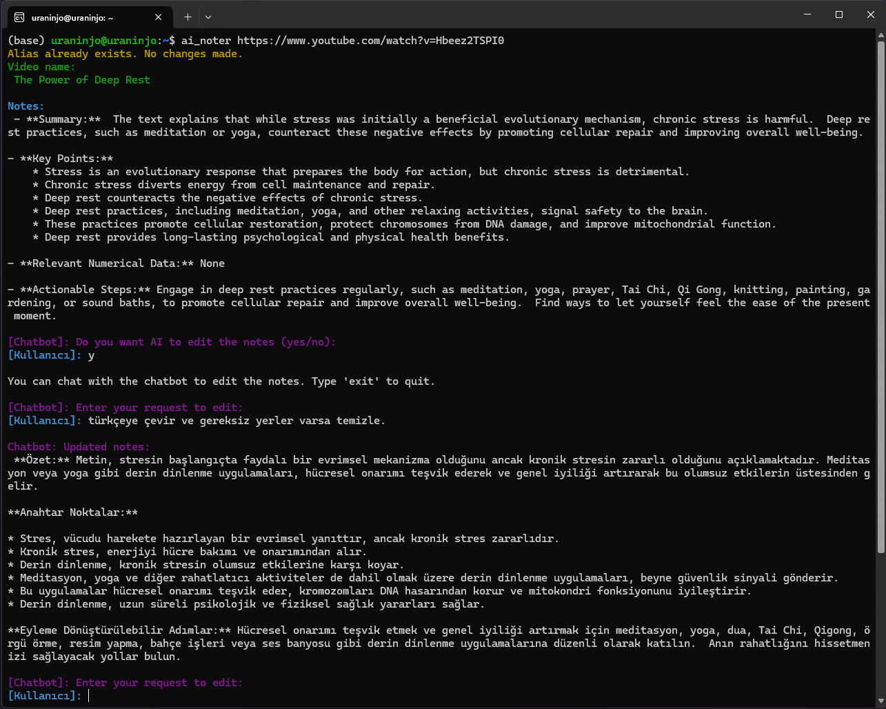
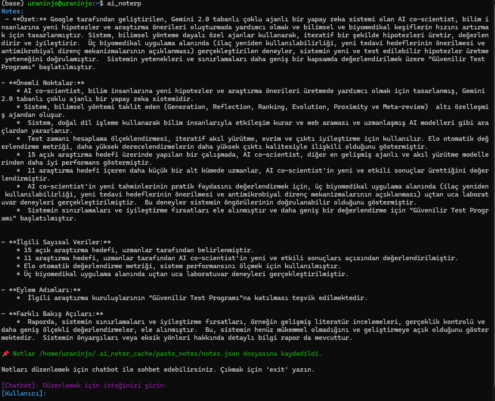

# **AI Noter**

AI Noter is a tool that extracts and processes notes from YouTube videos and copied text, leveraging Gemini and optionally Ollama models for enhanced summarization and insight extraction.

## **Setup**

### **1. Add API Key (Required for Gemini Model)**  
Add the following line to your `.bashrc` or `.zshrc` file and restart your terminal:

```sh
export GOOGLE_API_KEY=""
```


### **2. (Optional) Set Up a Conda Environment**
While not required, using Conda is recommended for an isolated environment:
```
conda create --name ai_noter python=3.12
conda activate ai_noter
pip install -r requirements.txt
```

## **Usage**  

AI Noter can be used in two ways:  

### Youtube Video Summarization and Insight Extraction
#### **1. Full Gemini + Ollama Model Support:**  
Use this command if you want to leverage both Gemini and an Ollama model:  

```sh
python ai_noter.py "https://www.youtube.com/watch?v=HbgzrKJvDRw" --model_size "large-v3" --use_ollama --ollama_model_name "deepseek-r1:14b"
```

#### **2. Simplified Usage(Gemini Default)**
If you prefer a shorter command (with default settings - Gemini), use:

```
ai_noter "https://www.youtube.com/watch?v=HbgzrKJvDRw"
```
📌 The extracted summary will be displayed on the terminal and optionally saved for further processing.



### Copied Text Summarization and Insight Extraction Tool
This feature processes copied text as input for an LLM, making it useful as a web scraper or for extracting insights from blog posts, articles, or any copied content.

1. Add Shortcut to Your Shell Profile

Add the following line to your `.bashrc` or `.zshrc` file and restart your terminal:

```sh
alias pbpaste="xsel --output --clipboard"
alias ai_noterp='pbpaste | python /home/$USER/ai_noter/pasted_notes/ai_noterp.py && python /home/$USER/ai_noter/pasted_notes/ai_noter_chat.py'
```

2. Run the Tool 
Run the tool by simply typing the following command in your terminal:

´´´sh
ai_noterp
´´´




