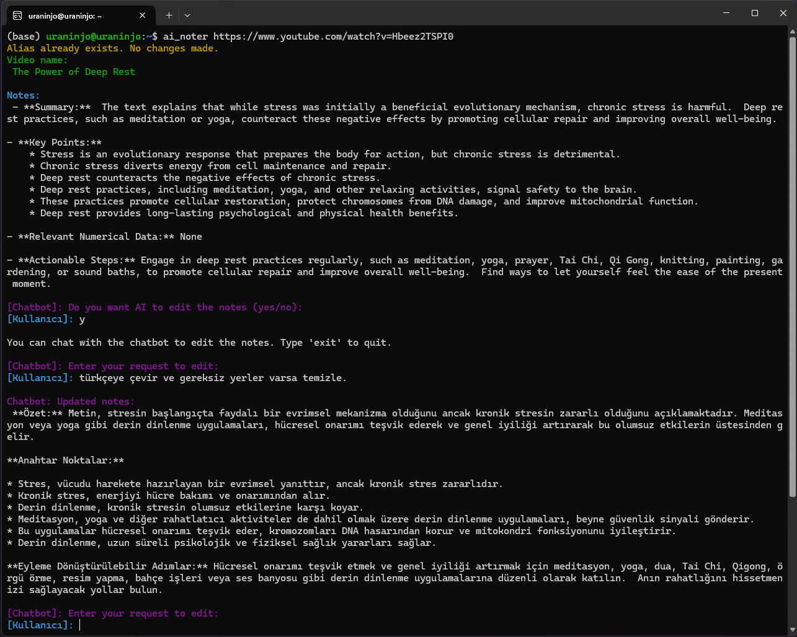

# **AI Noter**

AI Noter extracts and processes notes from YouTube videos using Gemini and optionally Ollama models.

## **Setup**

### **1. Add API Key (Required for Gemini Model)**  
Add the following line to your `.bashrc` or `.zshrc` file and restart your terminal:

```sh
export GOOGLE_API_KEY=""
```


### **2. (Optional) Set Up a Conda Environment**
While not required, using Conda is recommended for an isolated environment:
```
conda create --name ai_noter python=3.12
conda activate ai_noter
pip install -r requirements.txt
```

## **Usage**  

AI Noter can be used in two ways:  

### **1. With Full Gemini and Ollama Model Support:**  
Use this command if you want to leverage both Gemini and an Ollama model:  

```sh
python ai_noter.py "https://www.youtube.com/watch?v=HbgzrKJvDRw" --model_size "large-v3" --use_ollama --ollama_model_name "deepseek-r1:14b"
```

### **2. Simplified Usage:**
If you prefer a shorter command (with default settings - Gemini), use:

```
ai_noter "https://www.youtube.com/watch?v=HbgzrKJvDRw"
```

